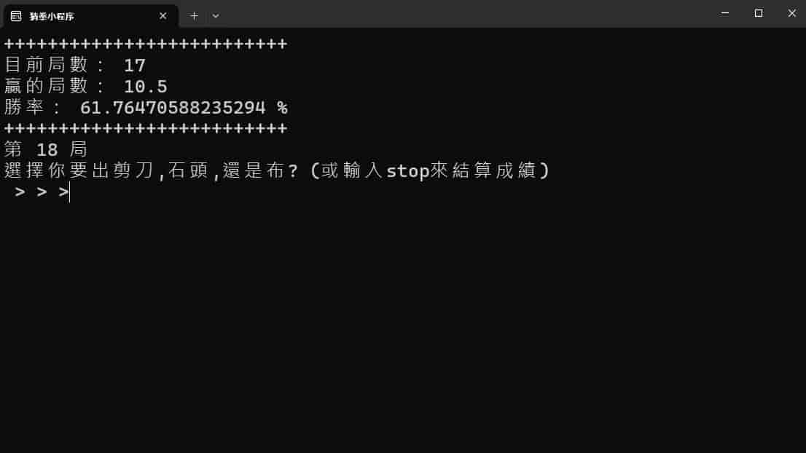
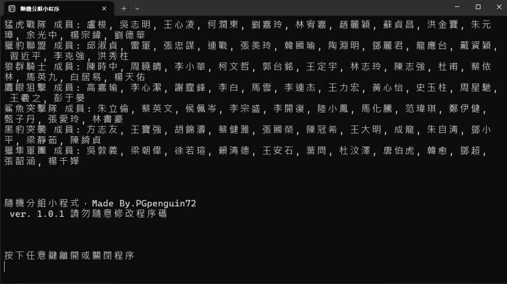
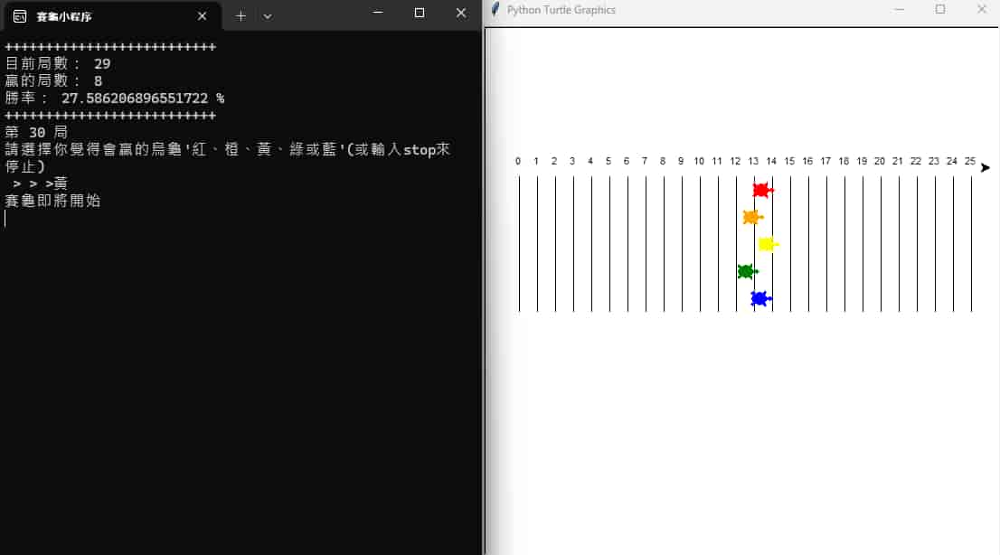

> [!IMPORTANT]  
> 程序請勿過分解讀，若有不適請停止使用並刪除，執行程序即代表你同意不隨意修改程式碼並尊重智慧財產權。
# 小程序大集結 ver.1.0.5
(程序圖片:)

    

## 如何使用:
選擇右上角的 "<>code" 按鈕，選擇"Download Zip"來下載程序。  
下載後解壓縮完成後，執行 main.py 選擇你想開啟的程序。

## 目前有的程序:
- [猜拳.py](https://github.com/PGpenguin72/Program?tab=readme-ov-file#%E7%8C%9C%E6%8B%B3)
* [隨機分組.py](https://github.com/PGpenguin72/Program?tab=readme-ov-file#%E9%9A%A8%E6%A9%9F%E5%88%86%E7%B5%84)
+ [賽龜.py](https://github.com/PGpenguin72/Program?tab=readme-ov-file#%E8%B3%BD%E9%BE%9C)

### 猜拳
輸入 " 剪刀 石頭 或 布" 可以與系統進行猜拳， 猜拳後會自動統計勝率。
若要結束遊戲可以輸入 "stop" 來做總結，並得到一段神奇的話。  
神奇的話:
> 勝率≥50: System:好哦好哦，阿不就好棒棒（誤  
> 勝率<50: System:蔡，就多練！輸不起就別玩（誤

### 隨機分組
輸入所有成員名單，並以「, 」隔開每個成員的名字(例如:小明, 小紅, 小黃)。系統隨機分組完後，用戶可以選擇要重新分組(以剛剛的資料繼續重新分組);重新開始(不保留任何資料);或是最後總結。  
若要結束程序可以輸入 "stop" 來做停止。

### 賽龜
輸入烏龜的顏色 " 紅 橙 黃 綠 或 藍" 可以猜哪個烏龜會跑最遠， 烏龜停止跑步後會自動統計命中率。
若要結束遊戲可以輸入 "stop" 來做總結，並得到一段神奇的話。  
神奇的話:
> 勝率≥20: System:厲害! 本作者都沒辦法玩到這麼高分呢:D  
> 勝率<20: System:啊? 這麼簡單的遊戲也可以輸成這樣?

## 如何提交建議
點擊右上角的 Code 按鈕後點擊 Download ZIP 來下載原始碼壓縮檔
或是使用 git clone 指令來複製一份原始碼到你的電腦上  
修改變更後開啟 Pull Request 來把你的變更合併到下一次的更新裡面  

## 製作者:
[PGpenguin72](https://github.com/PGpenguin72/) ``程式設計`` ``簡體中文翻譯`` ``文言文翻譯``  
[2008-04-03](https://github.com/2008-04-03) ``代碼優化``  
[dou_aguo](https://www.instagram.com/dou_aguo?igshid=NjZiMGI4OTY%3D) ``英文翻譯``

## 翻譯: 
簡體中文: [ ####       ] 未校對``38%``已校對``0%``  
繁體中文(港): [            ] 未校對``38%``已校對``0%``  
文言文: [ ********** ] 未校對``38%``已校對``0%``  
英文: [ ######**** ] 未校對``100%``已校對``57%``
